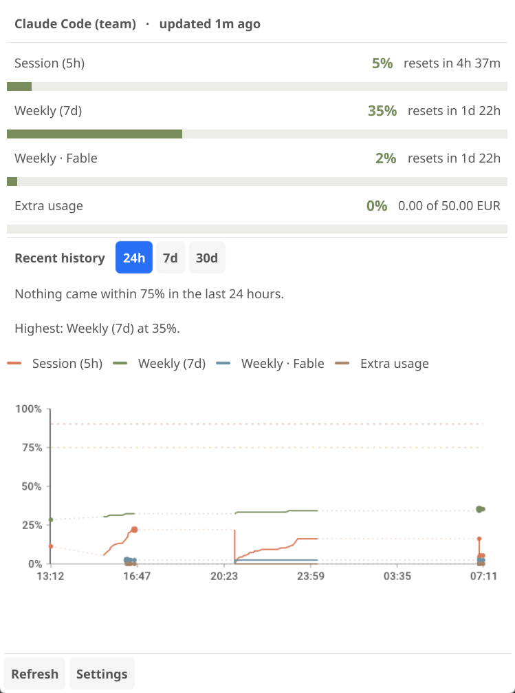

# Claude Monitor (Linux)

A Linux tray widget + CLI for monitoring Claude subscription usage.

Shows every usage limit Anthropic reports, fires desktop notifications at
configurable thresholds, and exposes a CLI so you can integrate with **waybar,
polybar, tmux, shell prompts, cron** — anywhere you want a fresh usage number
without launching a GUI.

A from-scratch Go implementation inspired by the macOS app
[rjwalters/claude-monitor](https://github.com/rjwalters/claude-monitor),
re-architected for Linux conventions: XDG paths, freedesktop SNI tray,
libnotify, distro packaging.

<p align="center">
  
</p>

> **Status:** pre-stable (`v0.3.x`). See [`docs/DESIGN.md`](docs/DESIGN.md).

## How it works

A **companion to [Claude Code](https://github.com/anthropics/claude-code)**. On
every poll it reads the live OAuth token from `~/.claude/.credentials.json` and
calls `GET https://api.anthropic.com/api/oauth/usage`. Claude Code keeps that
file fresh, so the app stays in sync with whatever account you're logged into.

**Single account by construction** — Claude Code holds one at a time. To switch,
run `claude /login`; the next poll picks it up.

Limits come from the API's self-describing `limits` array, keyed by kind and
model scope, so a limit Anthropic adds or renames shows up without an update.
Today that means the 5h session window, the 7d weekly window, per-model weekly
windows, and extra-usage credit spend.

## Features

- **Tray icon** with a two-bar 5h/7d visualization, colour-coded at 90/95%.
- **Dashboard** listing every current limit with its countdown, a close-calls
  summary answering *when did I last come near a limit*, and a 24h/7d/30d chart
  with 75/90% guides. Countdowns tick live, and polling gaps render as dashed
  bridges rather than as invented data.
- **Threshold notifications** per limit via `org.freedesktop.Notifications`
  (75/90/95% plus a rate-limited alert), debounced per reset window.
- **CLI**: `status`, `poll`, `tray`, `version`, `help`.
- **`status` formats**: plain text, `--json` (with a `limits` array), or
  `--format` Go template.
- **Autostart toggle**, XDG paths, SQLite + WAL, headless-safe CLI.

## Install

### From source

```bash
git clone https://github.com/achton/claude-monitor-linux
cd claude-monitor-linux
sudo apt-get install -y gcc pkg-config \
  libgl1-mesa-dev libxcursor-dev libxrandr-dev libxinerama-dev \
  libxi-dev libxxf86vm-dev xorg-dev \
  libwayland-dev libxkbcommon-dev wayland-protocols
make build
install -Dm0755 bin/claude-monitor ~/.local/bin/claude-monitor
```

Requires the Go version pinned in `go.mod` (1.25+, driven by Fyne). The Wayland
headers are needed even on an X11-only session, because GLFW compiles both
backends.

### Packages

`.deb` and AppImage builds are attached to
[Releases](https://github.com/achton/claude-monitor-linux/releases). A `.deb`
installs to `/usr/bin`; if you also have a copy in `~/.local/bin`, whichever
comes first on `PATH` wins — keep one.

## Quick start

Requires Claude Code installed and logged in — that's where the token comes from.

```bash
ls ~/.claude/.credentials.json   # verify Claude Code is logged in
claude-monitor tray --detach     # launch the tray
claude-monitor status            # or just print usage
```

No token setup, no account import, no configuration required.

## Integrating with status bars

### Waybar (`~/.config/waybar/config`)

```json
"custom/claude": {
  "exec": "claude-monitor status --format='{\"text\":\"LLM {{.PrimaryPercent}}%\"}'",
  "return-type": "json",
  "interval": 60
}
```

### tmux

```tmux
set -g status-right '#(claude-monitor status --format="LLM {{.PrimaryPercent}}%%")'
```

### Shell prompt (bash)

```bash
PROMPT_COMMAND='claude-monitor status --quiet || echo "⚠ Claude quota high"'
```

`PrimaryPercent` is the highest utilization across all limits. `status` exits 0
below 75%, 10 ≥75%, 20 ≥90%, 30 ≥95%, and 1 on error.

## File layout (per-user)

```
~/.claude/.credentials.json                 # read-only, owned by Claude Code
~/.local/share/claude-monitor/usage.db      # SQLite WAL, 0600 (history only)
~/.config/claude-monitor/config.toml        # TOML config, 0600
~/.local/state/claude-monitor/debug.log     # slog JSON, 0600
~/.config/autostart/claude-monitor.desktop  # only if autostart enabled
```

The database holds only the usage timeline behind the chart — no tokens, no
account metadata. Those are read from Claude Code's credentials file per poll.

## GNOME users

GNOME removed legacy tray support, so the icon needs the **AppIndicator and
KStatusNotifierItem Support** extension:

```bash
sudo apt install gnome-shell-extension-appindicator
gnome-extensions enable appindicatorsupport@rgcjonas.gmail.com
```

Then log out and back in. KDE, XFCE, Cinnamon, MATE and
Sway/Hyprland-with-Waybar work out of the box.

## Troubleshooting

Poll failures are logged to `~/.local/state/claude-monitor/debug.log` and shown
as a banner in the dashboard.

**"no Claude Code credentials"** — Claude Code isn't installed, or isn't logged
in. Run `claude /login`.

**"access token expired"** — Claude Code refreshes its token as you use it; run
any Claude Code command and the next poll recovers.

**"unauthorized"** — the token was rejected outright. Run `claude /login`.

**Tray icon missing on GNOME** — see above.

## License

MIT.
